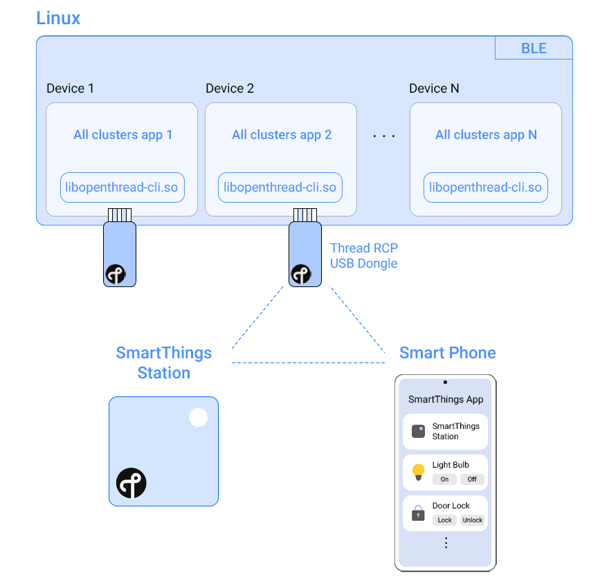

[!ioter-banner](res/doc/ioter-banner.png)

## Get started with ioter

Ioter acts as a device emulator for developers, testers, and manufacturers of connected devices that are compliant with Matter and Thread.

Benefits include:
- Flexibility: Multiple types of IoT devices can be implemented using a single RCP dongle.
- Multi-Device support: Each RCP dongle supports a single device. ioter supports up to 10 RCP dongles at a time.
- Low cost: Limited expenses for testing various IoT device types.
- Time savings: Virtual devices on demand - no need to search for and procure multiple IoT device types.
- Easy to use: Quickly control the status of devices from within ioter.
- Automated testing: Repeated testing through scripts can validate device stability and connection.

ioter emulates all Matter supported devices with a Linux PC and Thread RCP dongle. ioter runs the `All Cluster App` of Matter on a Linux PC to emulate multiple instances of various Matter supported IoT nodes. Each of these IoT nodes uses the underlying Thread RCP-based USB dongle (radio) for data transmission. By using the [SmartThings Station](https://www.smartthings.com/smartthings-station) as a border router and the SmartThings Application along with emulated IoT nodes, we can configure a smart home. This concept is demonstrated in the diagram below:



### Supported IoT devices (2023-04-27)

ioter supports a wide range of IoT devices including:

- Light Bulb
- Door Lock
- Contact Sensor
- Temperature Sensor
- Humidity Sensor
- Light Sensor
- Window Covering
- Occupancy Sensor
- OnOff Plugin

### Required tools
- Bluetooth-enabled Windows desktop or laptop.
- Ubuntu 22.04 (prior versions have Bluetooth conflicts). *All installation instructions have been validated on Ubunti 22.04 LTS.*
- USB hub with power input (USB 3.0 recommended).
- An onboarded SmartThings hub or SmartThings Station. An Apple HomePod (second gen) or HomePod Mini may also be used.
- A Thread RCP USB dongle. Below you can find a list of compatible dongles and setup guides for each dongle:
    1. **Nordic nrf52840** [OT RCP dongle guide](./docs/guides/README.md)   
    
    2. **Nordic nrf52840-DK board** [OT RCP board guide](https://openthread.io/codelabs/openthread-hardware#3)   
    
    3. **Silabs thunderBoardSense2** [OT RCP Silabs build&flash guide](https://docs.silabs.com/matter/2.0.0/matter-thread/matter-rcp)   
    
    4. **Silabs efr32-mighty-gecko-zigbee-and-thread-kit** [OT RCP Silabs build&flash guide](https://docs.silabs.com/matter/2.0.0/matter-thread/matter-rcp)   
    
    5. **ESP32-H2-DevkitM-1** [OT RCP ESP build&run guide](https://docs.espressif.com/projects/esp-thread-br/en/latest/esp32/dev-guide/build_and_run.html)   
    


## Install and run ioter

1. Install
```
cd ioter
./script/setup
```
2. Run
```
cd ioter
./script/run
```

> Alternatively, you can use a [**Docker image**](docs/guides/DOCKER.md).

## Onboard Matter supported devices
<!--  -->
> Before using ioter, ensure your SmartThings Stations has been onboarded in the SmartThings app.

After initiating ioter with the run script, the main window will appear with a list of devices.

1. Press the start button in the ioter window. The device control window will appear.
2. In the device control window that appears, click the power on button. This is the same as the power operation of an actual device. A QR code will be generated that can be used to onboard the device.
3. In the SmartThings app, click the add device button.

<!--  -->

4. Using the scan QR code option in the SmartThings app, scan the QR code shown in ioter. You may also pair using other options, including using a pairing code or scanning for nearby devices.

After onboarding your virtual device, your device is now controllable from within the SmartThings app.

## Automated testing

Use Automations to validate the connectivity and stability of various IoT device types. Some examples of how you can do this include:
- Test multiple devices in a loop.
- Use the + or - button to add/remove onboarded device or sleep commands.

Automation scrips are saved in XML format and can be loaded on demand. Once executed, the progress bar shows the current completion percentage.

[!references](res/doc/references.png)

1. Starts/ends the loop.
2. Add a command for the the onboarded device.
3. Add sleep for a given interval as specified below.
4. Device type (light bulb, contact sensor, etc.).
5. Supported commands for the onboarded device.
6. Device command’s value (for example, light bulb is On or Off).
7. Sleep interval, in seconds.
8. Loop count and loop interval, in seconds.
9. Clear all loops and commands.
10. Run the automation script.
11. Clear the log window.
12. Script completion progress bar.
13. The log window, showing activities including script loads, executions, saves, and number of successful/unsuccessful commands.

> Device/sleep commands can be reordered by using the ↑ and ↓ buttons.

## Known issues
### 1. Problem with specific linux kernel versions (higher than 5.16 and lower than 6.1.2)
The message below appears in the syslog:
```
kernel: wpan0 (unregistered): mctp_unregister: BUG mctp_ptr set for unknown type 65535
```

https://github.com/openthread/openthread/issues/8523

Please use a stable kernel version of 5.15.0-60-generic

```
$ sudo apt-get install aptitude
$ sudo aptitude search linux-image
$ sudo aptitude install linux-image-5.15.0-60-generic
$ sudo grub-mkconfig | grep -iE "menuentry 'Ubuntu, with Linux" | awk '{print i++ " : "$1, $2, $3, $4, $5, $6, $7}'
  ex)
    0 : menuentry 'Ubuntu, with Linux 5.19.0-32-generic' --class ubuntu
    1 : menuentry 'Ubuntu, with Linux 5.19.0-32-generic (recovery mode)'
    2 : menuentry 'Ubuntu, with Linux 5.15.0-60-generic' --class ubuntu
    3 : menuentry 'Ubuntu, with Linux 5.15.0-60-generic (recovery mode)'
$ sudo nano /etc/default/grub
   Find line GRUB_DEFAULT=...(by default GRUB_DEFAULT=0) and sets in quotes menu path to concrete Kernel.
   In my system first index was 1 and second was 2. I set in to GRUB_DEFAULT
   GRUB_DEFAULT="1>2"
$ sudo update-grub
```
### 2. With Ubuntu 20.04.2 LTS(Focal Fossa), there is a BLE connection issue while onboarding End Node. To use ioter please upgrade to Ubuntu 22.04 LTS or later.
https://github.com/project-chip/connectedhomeip/issues/6347

## Contributing

Interested in contributing to ioter? We welcome your contribution at any time. Visit our [Contribution Guidelines](https://github.com/Samsung/ioter/blob/main/CONTRIBUTING.md) for more information.
